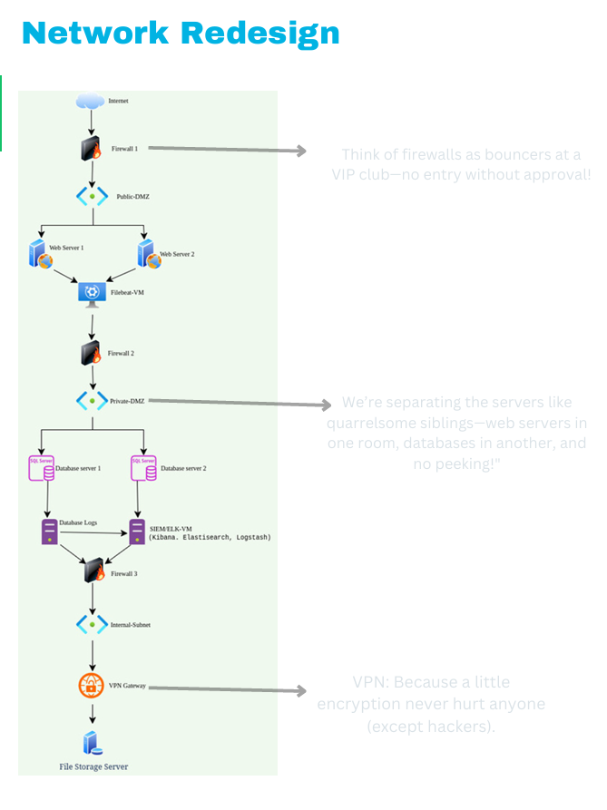

# Cryptocurrency Exchange Perimeter Security & Zero Trust Architecture Redesign

A cybersecurity consulting case study documenting the perimeter vulnerability assessment and Zero Trust network redesign for XYZ Exchange following a critical breach scenario.

---

## Executive Overview

Following a high-severity security breach resulting in the unauthorized exfiltration of 500+ Bitcoins from XYZ Exchange (a major cryptocurrency trading platform), our security consulting engagement was tasked with conducting a thorough architectural risk assessment of the exchange's network perimeter and formulating an enterprise-grade remediation architecture.

This repository contains the complete two-phase technical deliverables:
1. **Perimeter Vulnerability Assessment:** Identifying architectural design flaws that facilitated lateral movement and external exposure.
2. **Zero Trust Network Redesign:** Engineering a segmented, defense-in-depth architecture incorporating Demilitarized Zones (DMZs), stateful firewalls, encrypted VPN access for internal storage, and centralized SIEM log telemetry ingestion.

---

## Key Findings: Flawed Baseline Architecture

In the initial audit documented in **[architecture/1-network_vulnerabilities.md](./architecture/1-network_vulnerabilities.md)**, three critical structural vulnerabilities were identified:

1. **Flat Network Topology (Zero Segmentation):** All application tiers—public web servers, core database clusters, and internal corporate file storage—coexisted within a single broadcast domain without logical or physical isolation. A compromise of any single web server yielded unrestricted lateral movement across all corporate assets.
2. **Uncontrolled Internet Accessibility:** Critical internal backend servers were assigned direct internet routability, bypassing reverse proxies, NAT boundaries, and ingress packet filtering.
3. **Unrestricted File Storage Access:** Corporate file servers housing sensitive transaction ledgers and private keys were exposed to public routing paths without mandatory encryption or multi-factor authentication gates.

---

## The Redesigned Architecture

The proposed target architecture, detailed in **[architecture/2-secure_network_redesign.md](./architecture/2-secure_network_redesign.md)**, establishes rigorous trust boundaries based on Zero Trust principles:

* **Tiered DMZ Segmentation:**
  * **Public DMZ:** Hosts isolated web frontends and lightweight log forwarders (Filebeat). Direct communication with backend storage is prohibited.
  * **Private DMZ:** Houses core database clusters and centralized SIEM ingestion nodes (Elasticsearch, Logstash, Kibana).
* **Perimeter & Inter-Zone Firewall Enforcement:** Stateful packet inspection firewalls deployed between the Public DMZ, Private DMZ, and Internal subnet, enforcing strict least-privilege port/protocol whitelisting.
* **Encrypted Storage Access:** Internal file storage is isolated within a dedicated internal subnet, accessible strictly via encrypted IPSec VPN tunnels through an authenticated VPN gateway.
* **Centralized Telemetry Pipeline:** Comprehensive audit logging from web servers and database instances forwarded to the ELK SIEM stack for real-time security monitoring and anomaly detection.

---

## Network Architecture Diagram

<p align="center">
  
</p>

*The diagram above illustrates the multi-tier DMZ boundaries, firewall placement, VPN ingress tunnel, and SIEM log collection infrastructure.*

---

## Deliverables & Repository Structure

```
siem-zero-trust-deployment/
├── README.md                                  # Executive summary & case study navigation
└── architecture/
    ├── 1-network_vulnerabilities.md           # Phase 1: Vulnerability assessment of initial perimeter
    ├── 2-secure_network_redesign.md           # Phase 2: Detailed Zero Trust & DMZ redesign specification
    └── new-network-diagram.png                # Comprehensive architecture topology diagram
```

---

## Demonstrated Engineering Competencies

* **Network Architecture & Design:** Microsegmentation, DMZ engineering, IP subnets, VLAN design, and boundary protection.
* **Defensive Security & Threat Modeling:** Lateral movement suppression, blast radius reduction, ingress/egress filtering.
* **Standards & Compliance:** Alignment with NIST SP 800-207 (Zero Trust Architecture), ISO/IEC 27001, and Defense-in-Depth principles.
* **Technical Writing & Consulting:** C-level executive summaries and implementation specifications.

---

## Project Status

* **Status:** Complete Consulting Case Study & Architectural Specification.

---

## Author & Links

* **Author:** Siddh Samarth
* **GitHub:** [@SiddhSamarth](https://github.com/SiddhSamarth)
* **Portfolio:** [siddhsamarth.in](https://siddhsamarth.in)
* **LinkedIn:** [samarthsiddh](https://www.linkedin.com/in/siddhsamarth/)
